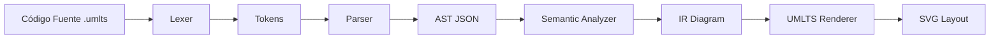

# Arquitectura del Compilador: ts-uml-engine

Este documento detalla las decisiones arquitectónicas tomadas para el motor de UMLTS, priorizando el aprendizaje académico y la claridad del código.

## 1. Pipeline del Compilador

El motor sigue un flujo lineal de transformación de datos:

### 1.1. Lexer (Análisis Léxico)

- **Aproximación**: Manual (Hand-written) con sistema de Matchers extensibles.
- **Responsabilidad**: Convertir el flujo de caracteres en una secuencia de objetos `Token`.
- **Manejo de Errores**: Identificación de caracteres ilegales con posición (line, column).

### 1.2. Parser (Análisis Sintáctico)

- **Aproximación**: **Recursive Descent Parser**.
- **Responsabilidad**: Validar la gramática y construir el Árbol de Sintaxis Abstracta (AST).

### 1.3. Semantic Analyzer (Análisis Semántico)

- **Responsabilidad**: Resolución de nombres (FQN), validación de jerarquías (ciclos, herencia múltiple prohibida) e inferencia de relaciones implícitas para generar la Representación Intermedia (IR).

### 1.4. IR y Renderer

- **IR (Intermediate Representation)**: Un modelo de datos purificado listo para el posicionamiento y dibujo.
- **Renderer**: Motor basado en ELK (Eclipse Layout Kernel) para el auto-layout y una capa de dibujo SVG nativa.

### 1.3. Árbol de Sintaxis Abstracta (AST)

- **Formato**: Objeto JSON serializable.
- **Objetivo**: Debe contener toda la información semántica (nombres, relaciones, visibilidad, tipos) de forma que cualquier renderizador pueda interpretarlo sin conocer la sintaxis original.

## 2. Decisiones Técnicas Clave

| Decisión                | Razón                                                                                                                                           |
| :---------------------- | :---------------------------------------------------------------------------------------------------------------------------------------------- |
| **No usar Generadores** | Para fines académicos, escribir el Lexer/Parser a mano permite entender profundamente el consumo de buffers y la predictividad de la gramática. |
| **JSON como Contrato**  | Facilita la integración con el ecosistema web (Playground) y VS Code (LSP) mediante una interfaz estándar.                                      |
| **SVG Renderer Nativo** | Arquitectura propia basada en ELK para el posicionamiento y SVG para el dibujo, garantizando control total sobre la estética y temas.           |

## 3. Próximos Pasos (Definición)

1.  **Definir la Gramática Formal**: Traducir la especificación v0.8 a una notación similar a EBNF para guiar el desarrollo del Parser.
2.  **Esquema del AST**: Definir las interfaces TypeScript que representarán cada nodo del árbol.
