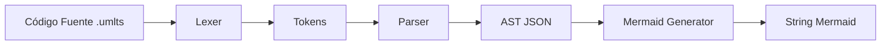

# Arquitectura del Compilador: ts-uml-engine

Este documento detalla las decisiones arquitectónicas tomadas para el motor de UMLTS, priorizando el aprendizaje académico y la claridad del código.

## 1. Pipeline del Compilador

El motor sigue un flujo lineal de transformación de datos:

### 1.1. Lexer (Análisis Léxico)
*   **Aproximación**: Manual (Hand-written) mediante un autómata de estados simple.
*   **Responsabilidad**: Convertir el flujo de caracteres en una secuencia de objetos `Token`.
*   **Manejo de Errores**: Identificación de caracteres ilegales con posición (row, col).

### 1.2. Parser (Análisis Sintáctico)
*   **Aproximación**: **Recursive Descent Parser**. Es una técnica top-down donde cada regla de la gramática se traduce a una función.
*   **Responsabilidad**: Validar que la secuencia de tokens siga las reglas de UMLTS v0.8 y construir el Árbol de Sintaxis Abstracta (AST).
*   **Recuperación de Errores**: Intentar continuar el parseo después de un error para encontrar múltiples fallos en una sola pasada.

### 1.3. Árbol de Sintaxis Abstracta (AST)
*   **Formato**: Objeto JSON serializable.
*   **Objetivo**: Debe contener toda la información semántica (nombres, relaciones, visibilidad, tipos) de forma que cualquier renderizador pueda interpretarlo sin conocer la sintaxis original.

## 2. Decisiones Técnicas Clave

| Decisión | Razón |
| :--- | :--- |
| **No usar Generadores** | Para fines académicos, escribir el Lexer/Parser a mano permite entender profundamente el consumo de buffers y la predictividad de la gramática. |
| **JSON como Contrato** | Facilita la integración con el ecosistema web (Playground) y VS Code (LSP) mediante una interfaz estándar. |
| **Mermaid Temporal** | Mermaid se utiliza exclusivamente como una herramienta de validación visual rápida durante el desarrollo del motor. |

## 3. Próximos Pasos (Definición)
1.  **Definir la Gramática Formal**: Traducir la especificación v0.8 a una notación similar a EBNF para guiar el desarrollo del Parser.
2.  **Esquema del AST**: Definir las interfaces TypeScript que representarán cada nodo del árbol.
